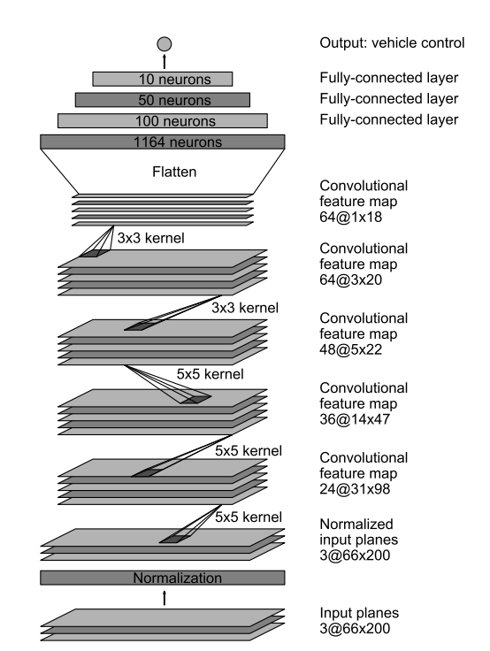
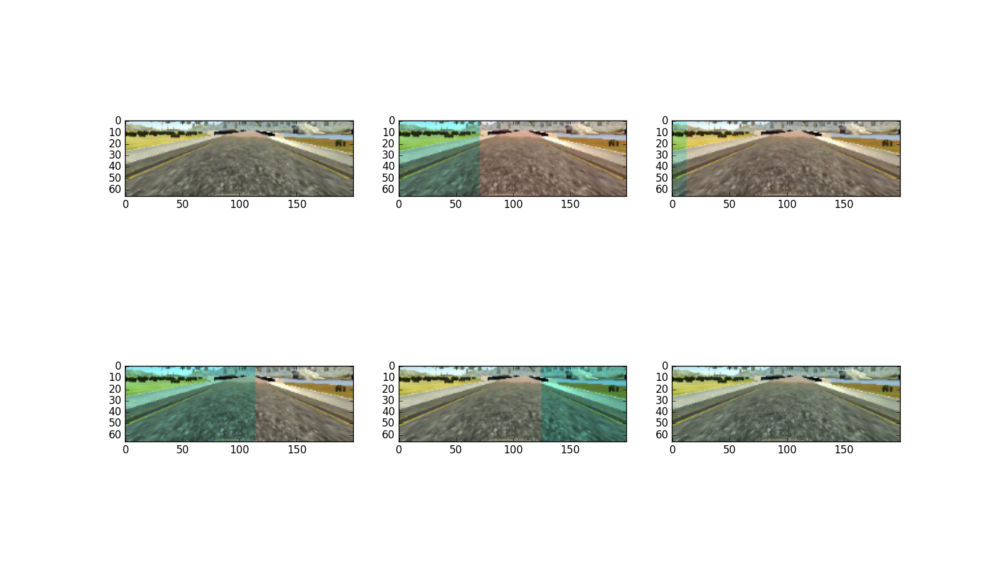
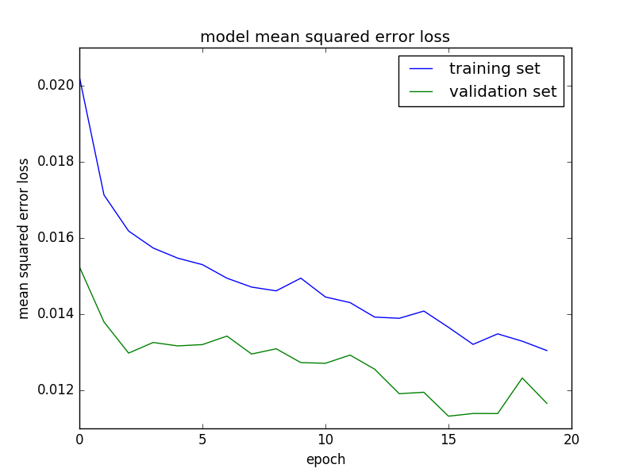

# **Behavioral Cloning**

## Writeup Template

### You can use this file as a template for your writeup if you want to submit it as a markdown file, but feel free to use some other method and submit a pdf if you prefer.

---

**Behavioral Cloning Project**

The goals / steps of this project are the following:
* Use the simulator to collect data of good driving behavior
* Build, a convolution neural network in Keras that predicts steering angles from images
* Train and validate the model with a training and validation set
* Test that the model successfully drives around track one without leaving the road
* Summarize the results with a written report


[//]: # (Image References)

[image1]: ./examples/placeholder.png "Model Visualization"
[image2]: ./examples/placeholder.png "Grayscaling"
[image3]: ./examples/placeholder_small.png "Recovery Image"
[image4]: ./examples/placeholder_small.png "Recovery Image"
[image5]: ./examples/placeholder_small.png "Recovery Image"
[image6]: ./examples/placeholder_small.png "Normal Image"
[image7]: ./examples/placeholder_small.png "Flipped Image"

## Rubric Points
### Here I will consider the [rubric points](https://review.udacity.com/#!/rubrics/432/view) individually and describe how I addressed each point in my implementation.

---
### Files Submitted & Code Quality

#### 1. Submission includes all required files and can be used to run the simulator in autonomous mode

My project includes the following files:
* data_reader.py this file contains a class called `Data()`, I write all data preprocessing and augmentation, generator in the class
* model.py containing the script to create and train the model
* drive.py for driving the car in autonomous mode
* path_to_abs_path.py A helper function that change the path in Udacity data to abs path in my computer
* model.h5 containing a trained convolution neural network
* writeup_report.md or writeup_report.pdf summarizing the results

#### 2. Submission includes functional code
Using the Udacity provided simulator and my drive.py file, the car can be driven autonomously around the track by executing
```sh
python drive.py model.h5
```

#### 3. Submission code is usable and readable

The model.py file contains the code for training and saving the convolution neural network. The file shows the pipeline I used for training and validating the model, and it contains comments to explain how the code works.

### Model Architecture and Training Strategy

#### 1. An appropriate model architecture has been employed

I used the Nvidia model which has been raised in this paper: https://arxiv.org/pdf/1604.07316.pdf. The architecture of the model is show in below:




My model consists of 3 convolution layer with 5x5 filter sizes and stride 2 and 2 convolution layer with 3x3 filter sizes and stride 1, I used valid padding.

After the convolutional layer is 4 fully connected layer. The number of neurons is just like the paper.

The model includes RELU layers to introduce nonlinearity, and the data is normalized in the model using a Keras lambda layer.

I add Dropout layer in my net, which is different from the Nvidia's paper.

#### 2. Attempts to reduce overfitting in the model

The model contains dropout layers in order to reduce overfitting (model.py lines 21).

The model was trained and validated on different data sets to ensure that the model was not overfitting (code line 10-16). The model was tested by running it through the simulator and ensuring that the vehicle could stay on the track.

#### 3. Model parameter tuning

The model used an adam optimizer, so the learning rate was not tuned manually (model.py line 44).

#### 4. Appropriate training data

I use several dataset to train the model:
* First is the Udacity dataset, it's center lane driving.
* Then I drive Counter-Clockwise for three laps, which is save in folder 'my-data'
* one lap focusing on driving smoothly around curves, which is saved in folder 'my-data-2'
* Then I collect one lap of recovery driving from the sides, which is is saved in folder 'my-data-3' and 'my-data-4'

For details about how I created the training data, see the next section.

### Model Architecture and Training Strategy

#### 1. Solution Design Approach

The overall strategy for deriving a model architecture was to look at the training loss and validation loss.

My first step was to use a convolution neural network model similar to the the Nvidia model, I thought this model might be appropriate after reading their paper.

In order to gauge how well the model was working, I split my image and steering angle data into a training and validation set. I found that my first model had a low mean squared error on the training set but a high mean squared error on the validation set. This implied that the model was overfitting.

To combat the overfitting, I add some dropout layers after every fully connected layer.

The final step was to run the simulator to see how well the car was driving around track one. There were a few spots where the vehicle fell off the track in the circle. To improve the driving behavior in these cases, I collect more driving with Counter-Clockwise driving and recovery driving from the sides.

At the end of the process, the vehicle is able to drive autonomously around the track without leaving the road.

#### 2. Final Model Architecture

The final model architecture (model.py lines 19-42) consisted of a convolution neural network with the following layers and layer sizes:


#### 3. Creation of the Training Set & Training Process

The data collection strategy is discussed in Section **Appropriate training data**

To augment the data sat, I gives 50% data random brightness and shadow, which is defined in the function `data_augmentation()` in data_reader.py. This picture shows the augmentation result:




After the collection process, I had 16200 of data points. I then preprocessed this data by the function:

```python
def preprocessing(self, img):
    # # change the color space to YUV
    img = cv2.cvtColor(img, cv2.COLOR_BGR2YUV)
    # crop the ROI
    img = img[50:140, :]
    # resize the image to (66, 200, 3) since we use the Nvidia Net
    img = cv2.resize(img, (200, 66))
    return img
```


I finally randomly shuffled the data set and put 10% of the data into a validation set.

I used this training data for training the model. The validation set helped determine if the model was over or under fitting. The loss of training and val is:



 The ideal number of epochs was 20 as evidenced by experiments. I used an adam optimizer so that manually training the learning rate wasn't necessary.
